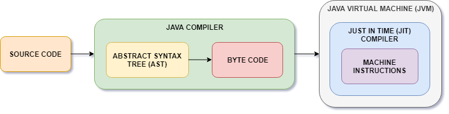
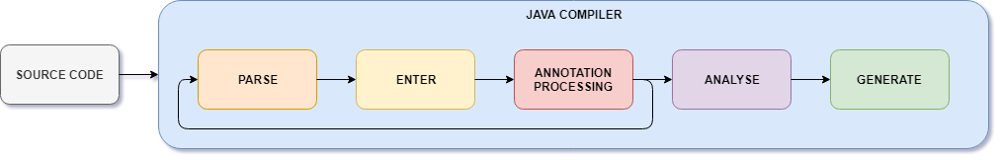

# How *tangerine* Works

One needs to understand the how a Java compiler works, to better understand how *tangerine* work, since *tangerine* hooks itself into a Java compiler's compilation process and modifies the *Abstract Syntax Tree (AST)*. Hence, we will start with the inner workings of the Java compiler.

## Java Internals

The following diagram depicts all the transformations which a Java source code undergoes before it is executed.

* The Java compiler converts human readable source code into byte code.
  * In the process of converting the source code to byte code, the compiler creates an *Abstract Syntax Tree (AST)*. The *AST* is a tree representation of the source code, details of which could be found [here](https://en.wikipedia.org/wiki/Abstract_syntax_tree).
  * The Java compiler then optimizes the *AST* and finally converts it into machine-independent byte code.
* The *Just-In-Time (JIT)* compiler, which is a part of the Java runtime, converts the machine-independent byte code into machine instructions, which is finally executed.

## Java Compiler Internals

The following diagram depicts the various phases which a source code goes through in the Java compiler (*javac*).

* In the *parse* phase, the Java compiler parses the source code and creates an *AST* corresponding to the source code.
* The *AST* is then passed through the *enter* phase where all the symbols in the *AST* are entered into a symbol table.
* Next, the compiler passes the *AST* through the *annotation processing* phase where the *AST* is passed through all the registered annotation processors. If an annotation processor generates new code while processing an *AST*, the Java compiler passes the newly generated code to the *parse* phase.
* Then the *AST* is analysed in the *analyse* phase. The symbol definition of all the symbols are wired in this phase.
* Finally, the *AST* is converted into byte code in the *generate* phase.

More details on Java compiler phases could be found [here](http://openjdk.java.net/groups/compiler/doc/compilation-overview/index.html).

